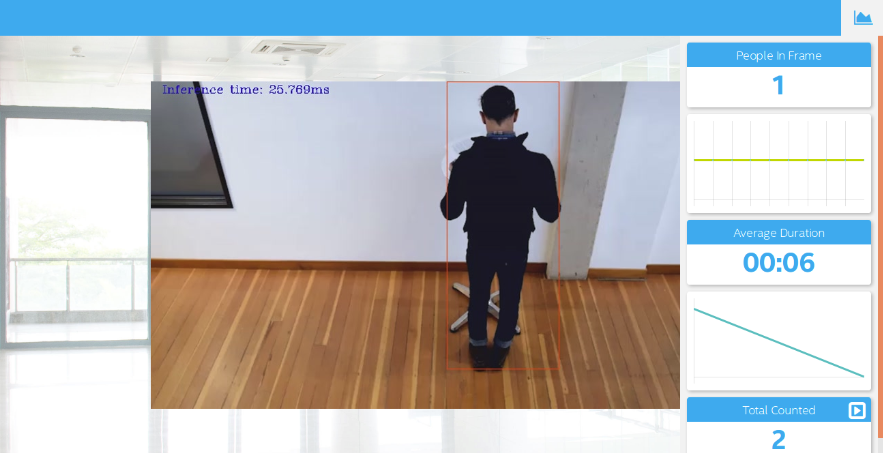

# Intel Edge AI for IoT Developers Nanodegree Projects

  This repository contains projects of [Intel Edge AI for IoT Developers Nanodegree](https://www.udacity.com/course/intel-edge-ai-for-iot-developers-nanodegree--nd131).

## [Deploy a People Counter App at the Edge](https://github.com/RoumaissaaMadoui/intel-edge-AI-for-IoT-developers-nanodegree-projects/tree/master/deploy-a-people-counter-app-at-the-edge)
   Application to detect people in a designated area, provide the number of people in the frame, average duration of people in frame, and total count.
   

## [Smart Queuing System](https://github.com/RoumaissaaMadoui/intel-edge-AI-for-IoT-developers-nanodegree-projects/tree/master/smart-queuing-system)
   
   Application to reduce congestion and queuing systems.

   |  Manufacturing Sector   |  Retail Sector |  Transportation Sector  |
   |  :---: | :---: | :---: |
   |  |  | |

## [Computer Pointer Controller](https://github.com/RoumaissaaMadoui/intel-edge-AI-for-IoT-developers-nanodegree-projects/tree/master/computer-pointer-controller)
  
   Application to change the mouse pointer position according to the gaze of the user's eyes.

# Licence
The contents of this repository are covered under the [MIT License](https://github.com/RoumaissaaMadoui/intel-edge-AI-for-IoT-developers-nanodegree-projects/blob/master/LICENSE).
