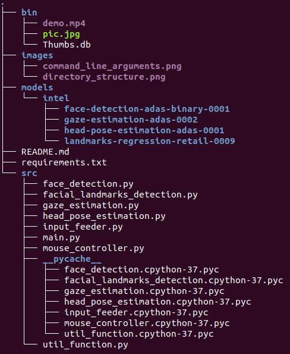
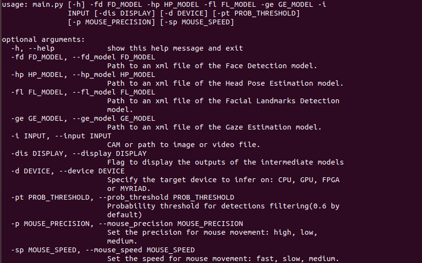

# Computer Pointer Controller

| Details            |              |
|-----------------------|---------------|
| System | Ubuntu 18.04|
| OpenVINO™ Toolkit | 2020.3|
| Processor | Intel(R) Core(TM) i5-4200U |

In this project, you will use a gaze detection model to control the mouse pointer of your computer. You will be using the [Gaze Estimation](https://docs.openvinotoolkit.org/latest/_models_intel_gaze_estimation_adas_0002_description_gaze_estimation_adas_0002.html) model to estimate the gaze of the user's eyes and change the mouse pointer position accordingly.

## Project Set Up and Installation

- Install [OpenVINO™ Toolkit](https://docs.openvinotoolkit.org/latest/index.html)

- Set the Environment Variables
  ```
  source /opt/intel/openvino/bin/setupvars.sh
  ```
- Install the `virtualenv` package
  ```
  pip install virtualenv
  ```
- Create a virtual environment `computer-pointer-controller`
  ```
  virtualenv computer-pointer-controller
  ```
- Activate the virtual environment
  ```
  source computer-pointer-controller/bin/activate 
  ```
- Get inside the project folder
  ```
  cd `computer-pointer-controller`
  ```
- Install requirements
  ```
  pip install -r requirements.txt 
  ```
- Create a folder for the models
  ```
  mkdir models
  ```
- Get inside the models folder
  ```
  cd models
  ```
- Downlod the models
  - Download [face detection model](https://docs.openvinotoolkit.org/latest/_models_intel_face_detection_adas_binary_0001_description_face_detection_adas_binary_0001.html)
    ```
    sudo /opt/intel/openvino/deployment_tools/open_model_zoo/tools/downloader/downloader.py --name face-detection-adas-binary-0001
    ```
  - Download [head_pose_estimation model](https://docs.openvinotoolkit.org/latest/_models_intel_head_pose_estimation_adas_0001_description_head_pose_estimation_adas_0001.html)
    ```
    sudo /opt/intel/openvino/deployment_tools/open_model_zoo/tools/downloader/downloader.py --name head-pose-estimation-adas-0001
    ```
  - Download [facial landmarks detection model](https://docs.openvinotoolkit.org/latest/_models_intel_landmarks_regression_retail_0009_description_landmarks_regression_retail_0009.html)
    ```
    sudo /opt/intel/openvino/deployment_tools/open_model_zoo/tools/downloader/downloader.py --name landmarks-regression-retail-0009
    ```
  - Download [gaze estimation model](https://docs.openvinotoolkit.org/latest/_models_intel_gaze_estimation_adas_0002_description_gaze_estimation_adas_0002.html)
    ```
    sudo /opt/intel/openvino/deployment_tools/open_model_zoo/tools/downloader/downloader.py --name gaze-estimation-adas-0002
    ```
- Deactivate the virtual environment
  ```
  deactivate
  ```
- Project directory structure

  

## Demo

[](http://www.youtube.com/watch?v=Riu-3dcpIOg "")

To run a basic demo of the app, run the following commands:

- Activate the virtual environment
  ```
  source computer-pointer-controller/bin/activate 
  ```
- Get inside the project folder
  ```
  cd computer-pointer-controller 
  ```
- Set the Environment Variables
  ```
  source /opt/intel/openvino/bin/setupvars.sh 
  ```
- Run the app
  ```
  python src/main.py  \
  -fd models/intel/face-detection-adas-binary-0001/FP32-INT1/face-detection-adas-binary-0001.xml  \
  -hp models/intel/head-pose-estimation-adas-0001/FP32/head-pose-estimation-adas-0001.xml \
  -fl models/intel/landmarks-regression-retail-0009/FP32/landmarks-regression-retail-0009.xml \
  -ge models/intel/gaze-estimation-adas-0002/FP32/gaze-estimation-adas-0002.xml \
  -i bin/demo.mp4
  ```

## Documentation


## Benchmarks

Device = CPU

I didn't move the mouse

|            | FP32 | FP16 | INT8 |
|----------------|-------|-------|--------|
|Total model loads time (s) | 0.48 | 0.52 | 0.77 |
| Total inference time (s) | 12.00 | 11.82 | 11.78 |

## Results

- Lower precision model give lower accuracy. 
- When using lower inference models the inference becomes faster.
